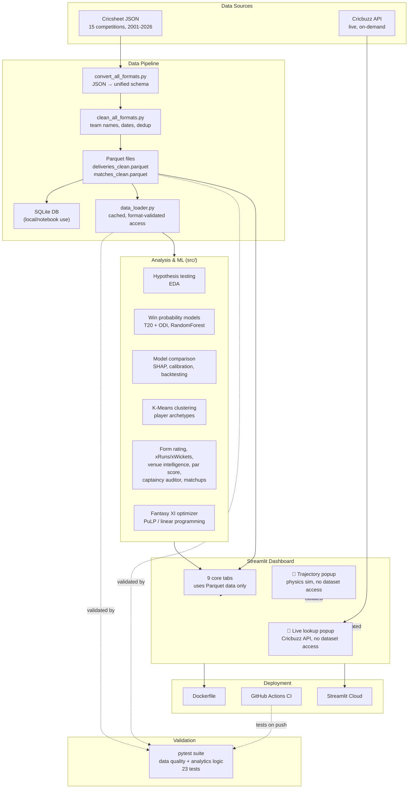

# System Architecture

**Design notes:**
- The two live add-ons (trajectory simulator, Cricbuzz lookup) are deliberately isolated — they import nothing from the core pipeline and the core pipeline never imports them, so either can fail or be removed without affecting the other.
- `data_loader.py` is the single point of entry for the dataset, added after an earlier bug where a script silently loaded all 15 competitions instead of IPL-only, caused by duplicated, inconsistent loading code across files.
- Models and large intermediate files are Parquet-compressed and gitignored where they exceed GitHub's 100MB limit; only the dashboard-required artifacts are committed.